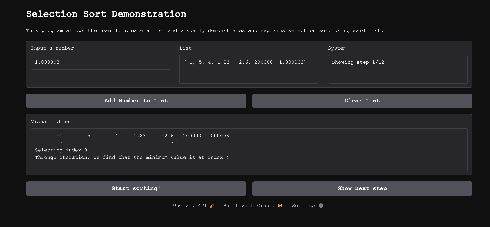
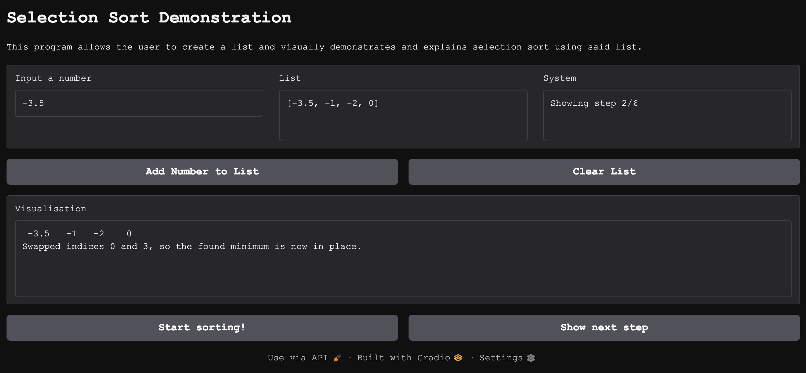
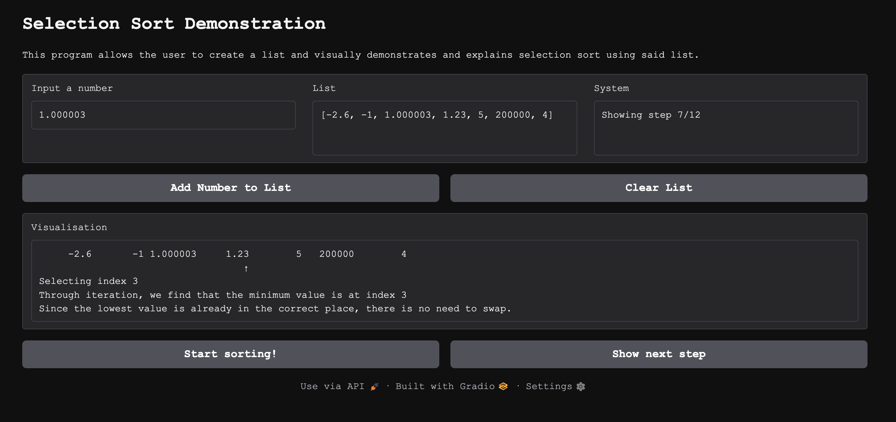
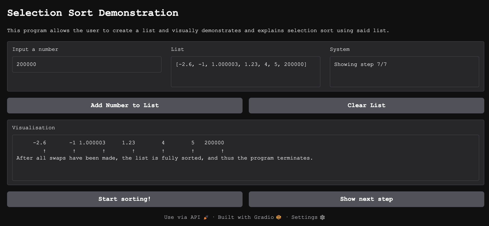
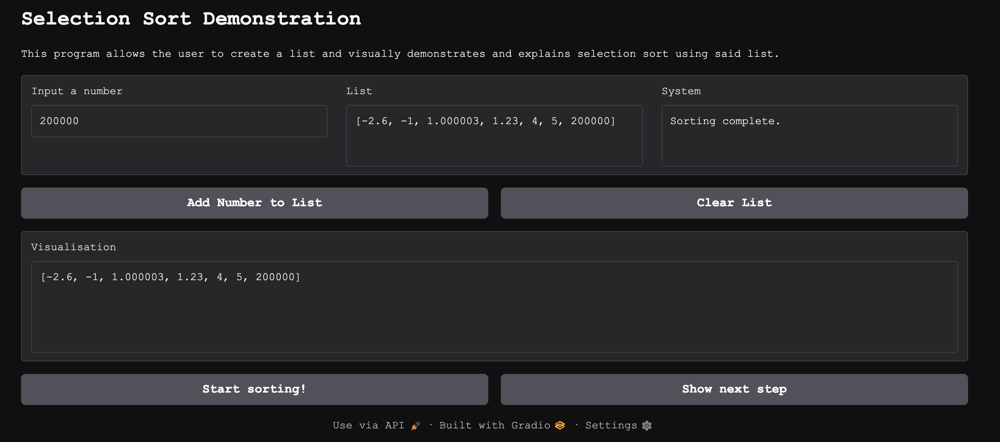
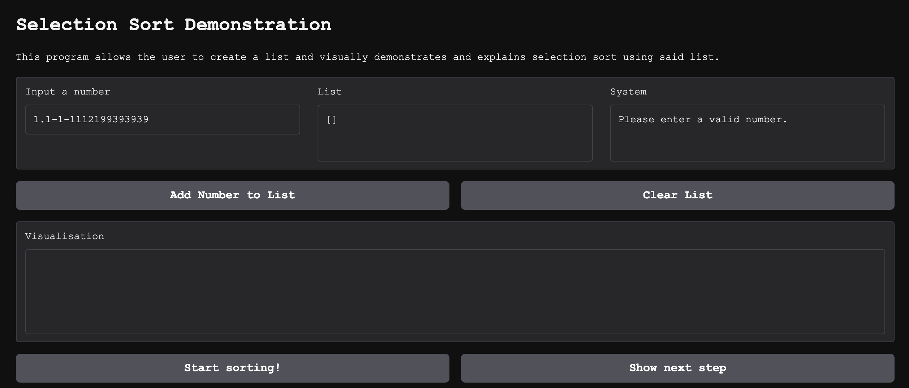
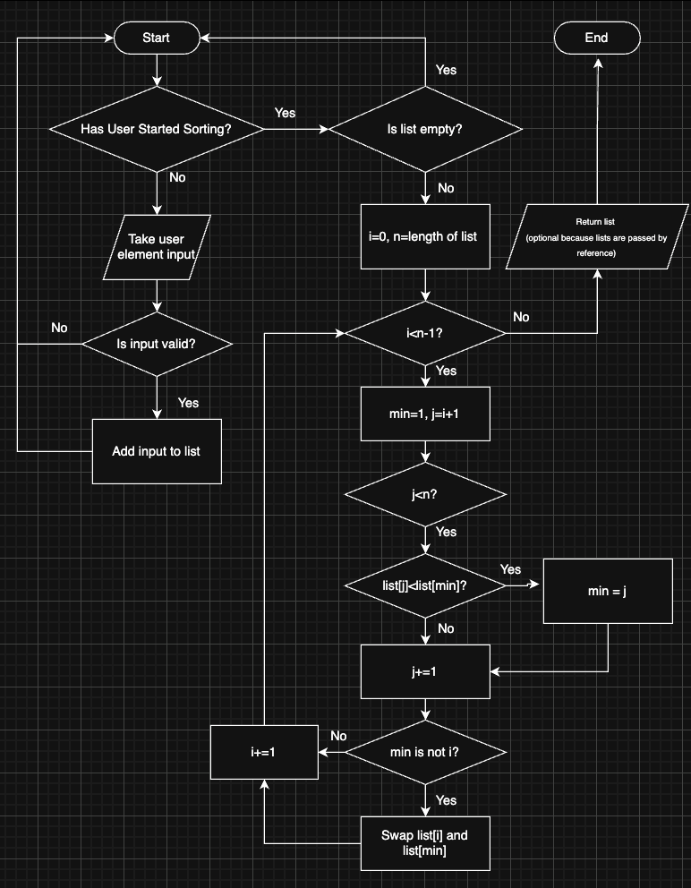

# CISC121-Final-Project
Selection Sort Demonstration

# Selection Sort
I chose selection sort because prior to this course it was the algorithm I was least familiar with, so I believed that working with it for this assignment would grant me a deeper understanding and would bring me the most benefit out of the sorting/searching options.

## Tests

## Problem Breakdown & Computational Thinking
Decomposition:
In selection sort there are two main processes:
- An outer loop that iterates through the non-sorted components
- An inner loop that iterates through the list and finds the minimum value

Pattern Recognition:
- Selection sort reaches values with nested for loops through iteration methods described in the decomposition section
- Selection sort compares values with the indexes of the for loops: If the minimum value it finds further down the list than the compared index, it swaps the two and increments the compared index (index of first unsorted element)

Abstraction:
- The user should see the pointers comparing the elements when there is a swap, as well as arrows pointing at the compared element if the element is already in its correct location (no swap required)
- I do not believe it is necessary to visually show every loop through the list as that would add many steps and lengthen to the demonstration, but it can be included in the text explanation during the demonstration that the minimum is found through linear iteration. 
- A visual indicating completion can be added once the entire list is sorted to add to clarity of use.

Algorithm Design:
- The user will be able to create/edit/delete a list by inputting individual elements and by having the option to clear the list (this will be done via input textboxes and buttons in the GUI) 
- There will be a textbox that displays the list
- There will be a textbox that walks the user through the sorting process
- There will be a textbox that gives feedback similar to a console
- There will be buttons that control the display of the sorting process

Flowchart: 

## Steps to Run
- Create a list by inputting individual numbers
- Click "Start sorting!"
- Use the "Show next step" button to view each step of the sorting process
- You can empty the list using the "Clear List" button if you would like to make a new list

## Hugging Face Link: https://huggingface.co/spaces/JoshuaPuusaari/CISC121-Final-Project

## Author & Acknowledgement: Joshua Puusaari
